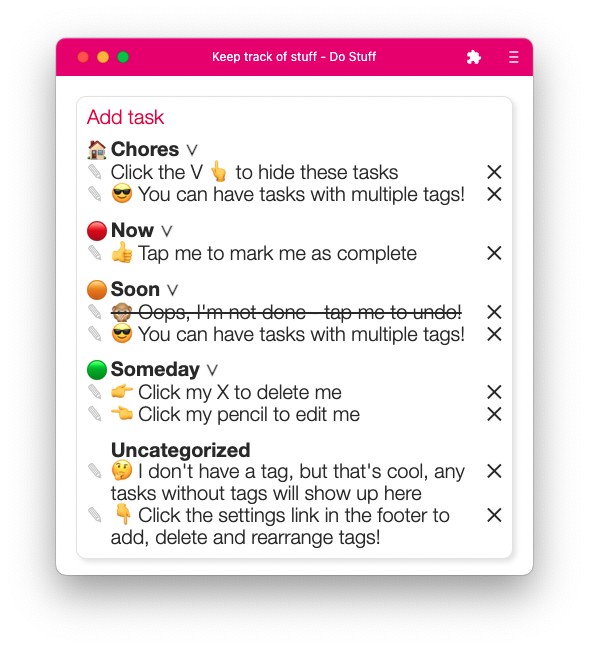

# Do Stuff

**Keep track of your tasks**

See it live: [katestasks.surge.sh](https://katestasks.surge.sh/)

A powerful little Progressive Web App for keeping track of tasks. Works offline and optimized to act like a native mobile/desktop app when downloaded. Saves data to IndexedDB, utilizes React Router, Redux, context, custom hooks, portals, and suspense. Items are sortable with HTML5 Drag and Drop API. As a brand new, active project, there are lots more features I'm regularly building in! Like a whole calendar feature. The functionality is there, still working on styling it before it goes to prod.

